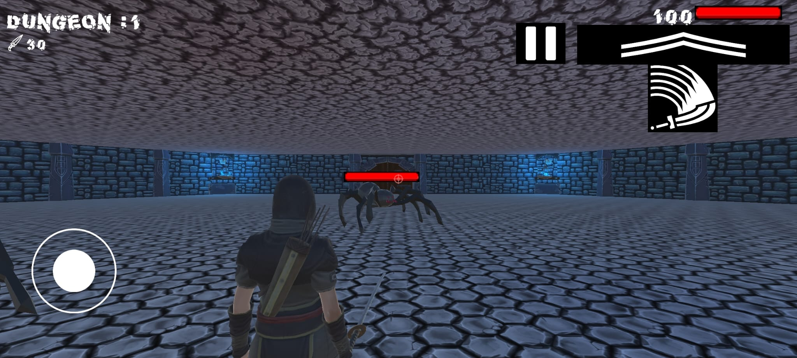

<!-- # JS-DAW-2022-practicas-Lorenzo
 Desarrollo Web en Entorno Cliente

Editado Lorenzo Navarro Jiménez -->

# Sobre mi , Lorenzo Navarro Jiménez 

*Programador y Técnico Informático* :computer:

---
Titulos  :mortar_board:

* Grado Medio Sistemas Microinformáticos y Redes
* Grado Superior Desarrollo Aplicaciones Multiplataforma
* Grado Superior Desarrollo Aplicaciones Web

Proyectos :space_invader:

* Videojuego Dungeon 256 en Play Store Android :video_game:

<!-- {width=2cm} -->
Aptitudes :floppy_disk:

<!--

 -->

Contacto :mailbox:

# 📊 GitHub Stats:
 