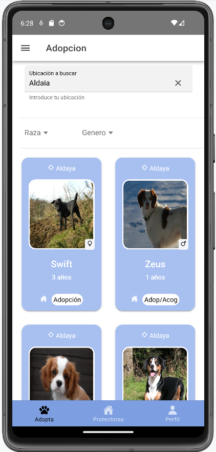
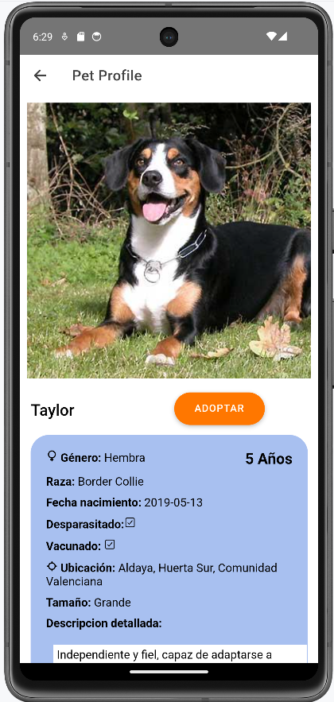
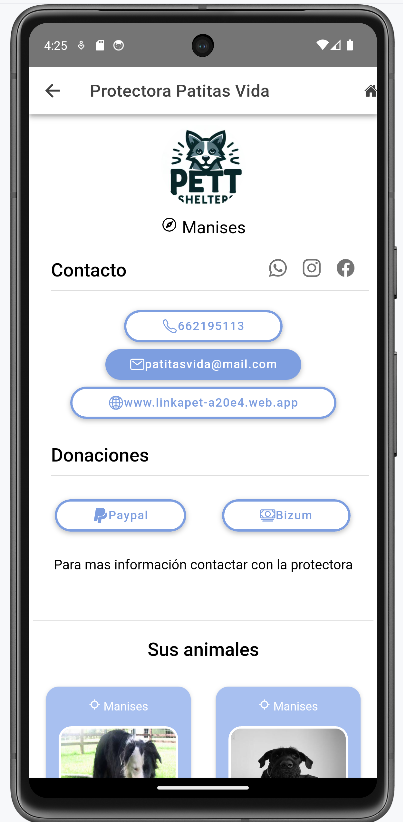

# Sobre mi , Lorenzo Navarro Jiménez 

*Programador de aplicaciones web y multiplataforma* :computer:

---
## Titulos  :mortar_board:

* Grado Medio Sistemas Microinformáticos y Redes
* Grado Superior Desarrollo Aplicaciones Multiplataforma
* Grado Superior Desarrollo Aplicaciones Web

## Proyectos :space_invader:

### Videojuego Dungeon 256 en Play Store Android :video_game:

Link:

<a href="https://play.google.com/store/apps/details?id=com.lnzcreations.Dungeon256">
https://play.google.com/store/apps/details?id=com.lnzcreations.Dungeon256</a>

### Web / App de adopción de animales 'Link A Pet'

Links : 
https://linkapet-a20e4.web.app/tabs/adopcion

<a href="https://play.google.com/store/apps/details?id=lnzcreations.linkapet">
https://play.google.com/store/apps/details?id=lnzcreations.linkapet</a>

<!-- {width=2cm} -->
## Aptitudes :floppy_disk:

<!--

 -->

 ## Contacto :mailbox:

* <a href="https://www.beacons.ai/lorenzon">beacons.ai/lorenzon</a>

* <a href="https://www.linkedin.com/in/lorenzo-navarro-jimenez"> https://www.linkedin.com/in/lorenzo-navarro-jimenez</a>

*   lorenzonajm@gmail.com
<!-- 
# 📊 GitHub Stats:
 
-->
